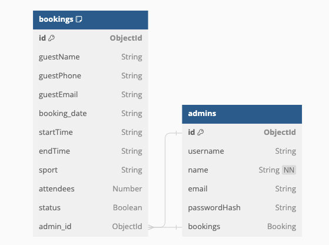
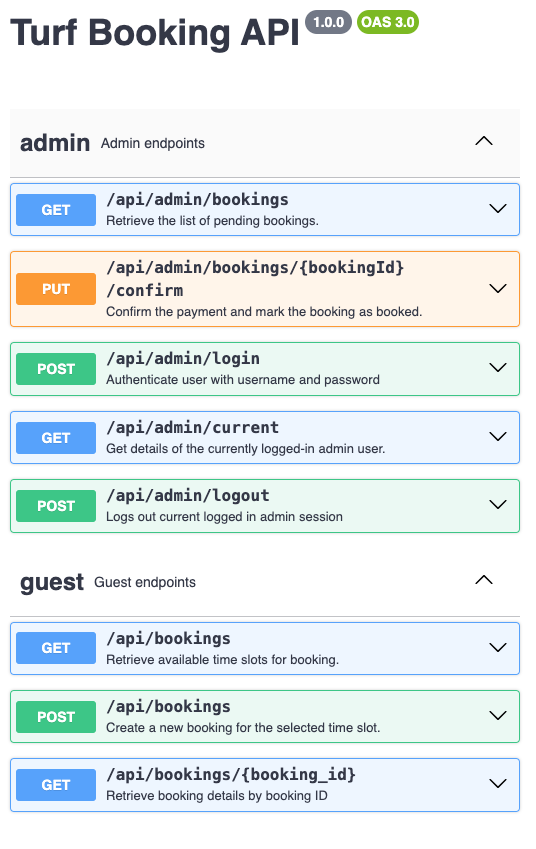

# Turf Booking Backend
Welcome to the Turf Booking System backend repository! This service is an essential part of the platform, managing user bookings, slot availability, and providing a seamless experience for both guests and admins. The backend is built using Node.js, Express, and MongoDB, ensuring reliable and efficient operations.

The Backend service is deployed on serverless AWS Lambda, providing high availability and scalability. The database is hosted on MongoDB Atlas, providing a reliable and secure database solution.

## API Specification:
<b> Database schema and collections: </b>

[](https://github.com/10kartik/turf-reservation-api/blob/master/docs/dbSchema.dbml)


<b> API Endpoints: </b>

[](https://github.com/10kartik/turf-reservation-api/blob/master/docs/openAPI.yaml)

- <b> Checkout Postman Collection [here](https://github.com/10kartik/turf-reservation-api/blob/master/docs/Turf-Booking-API.postman_collection.json). </b>

## Getting Started

This section provides a quick start guide to get the Turf Booking Backend up and running on your local machine for development and testing purposes.

### Prerequisites

Ensure that you have the following installed on your local development machine:

- Node.js (version 14 or newer)
- npm (usually comes with Node.js)

### Installing

1. **Fork the Repository**: Click on the 'Fork' button at the top right corner of this page. This will create a copy of this repository in your GitHub account.

2. **Clone the Repository**: Clone the forked repository to your local machine. To clone a repository, click on the 'Code' button at the top right corner of the repository page, and copy the HTTPS URL. Then, run the following command in your terminal:

```bash
git clone git@github.com:10kartik/turf-reservation-api.git
```

3. **Install Dependencies**: Navigate to the cloned repository and run the following command to install all the dependencies:

```bash
npm install
```

4. **Set Environment Variables**: Rename the sample.env file to .env and update the variables with your specific configuration. The file includes the following environment variables:
```bash
ENVIRONMENT=development
DB_SUFFIX=dev
APP_NAME=turf-reservation-api
PORT=3000
JWT_SECRET=secret
MONGODB_CONNECTION_STRING=mongodb+srv://<username>:<password>@<host>/<database>?retryWrites=true&w=majority
```

5. **Start the Server**: Run the following command to start the server:

```bash
npm start
```

That's it! The server should now be running at http://localhost:8080.
